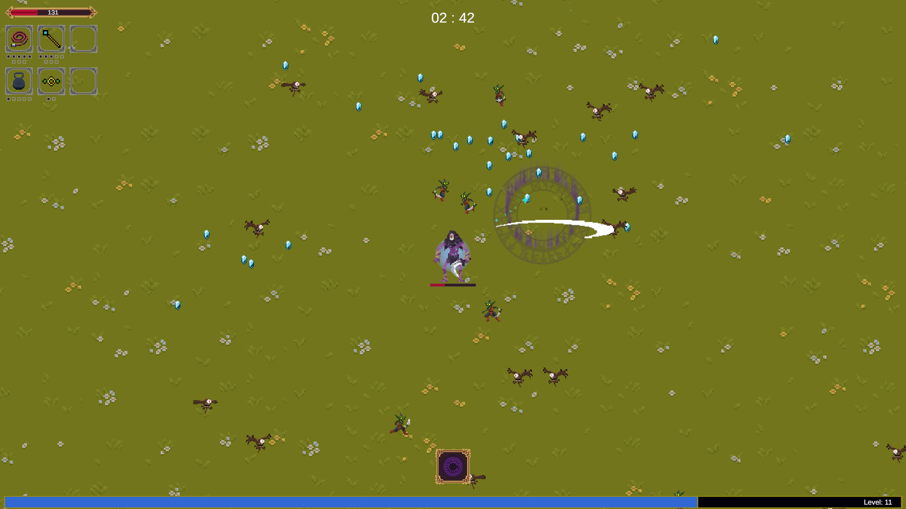
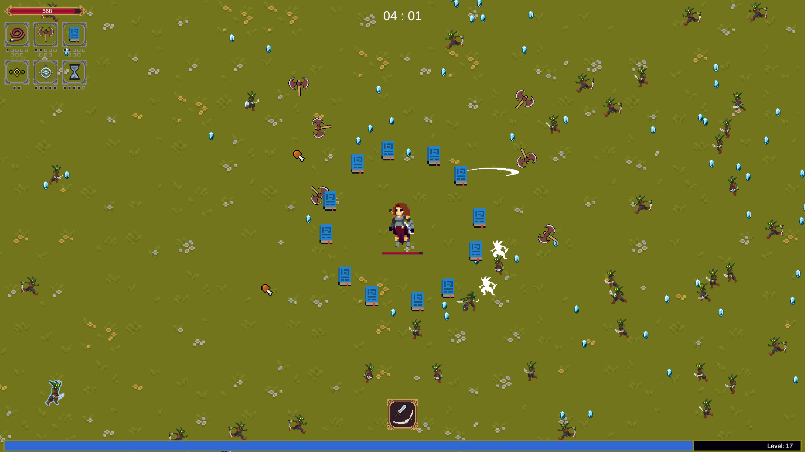
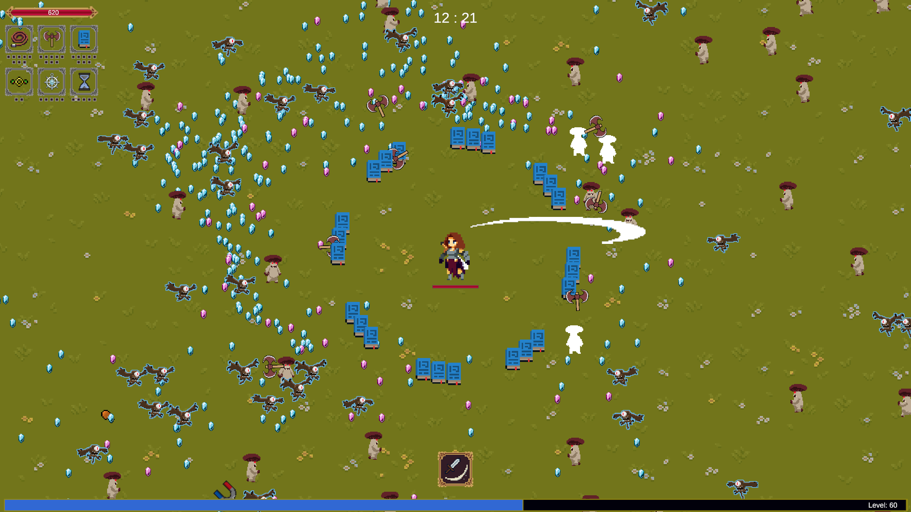
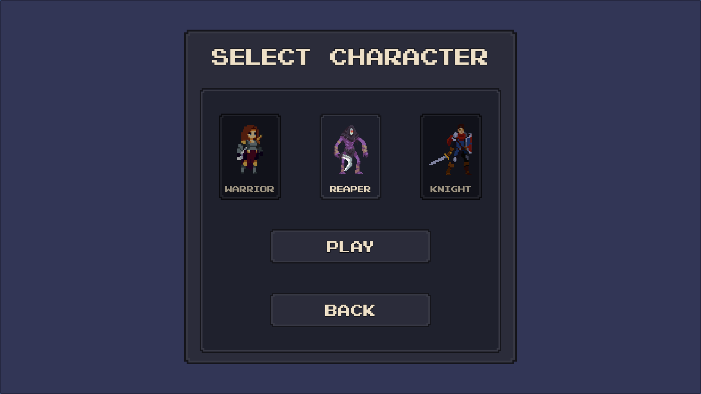
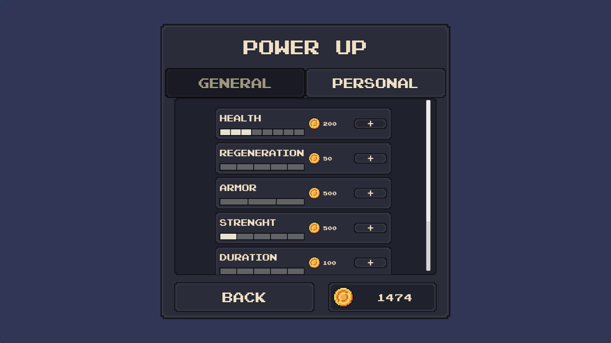
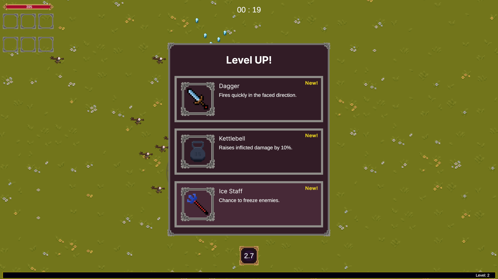
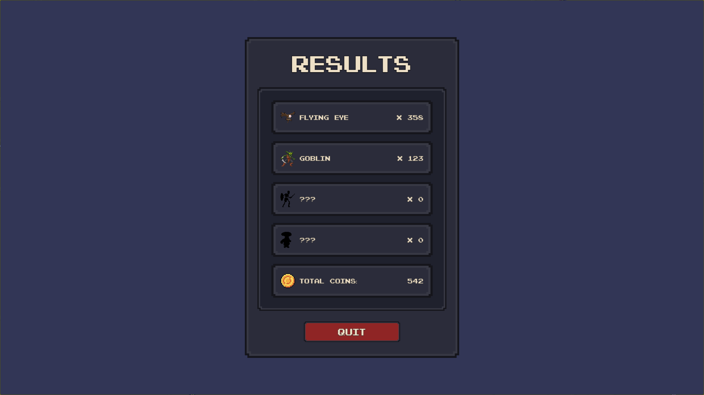

# RogueType

Procedural action roguelike inspired by **Vampire Survivors**.

Fight through waves of enemies, level up during the run, unlock permanent upgrades, and survive as long as possible.

---

## 🎮 Core Gameplay

---

## 🧙 Character Selection

Choose between playable characters with different stats and playstyles.

---

## ⬆ Meta Progression System

Permanent upgrades available between sessions.

---

## 🎁 In-Run Upgrade Selection

Level up during the run and choose between randomized upgrades.

---

## 📊 Match Results

Post-run statistics and enemy breakdown.

---

## 🕹 Controls

| Action     | Key |
|------------|-----|
| Move       | WASD / Arrow Keys |
| Attack     | Space |
| Skill      | E |
| Pause      | Esc |

---

## 🛠 Tech Overview

- Unity
- C#
- Custom FSM architecture
- Modular enemy system
- Procedural wave spawning
- Upgrade & progression system
- Persistent player upgrades

---

## ▶ Download

[Download Windows Build](https://github.com/Gh0stlyAngel/RogueType/releases)

Unzip and launch: `RogueLike - Prototype.exe`
